<picture>
  <source media="(prefers-color-scheme: dark)" srcset="./assets/banner-dark.svg">
  
</picture>

  <picture>
    <source media="(prefers-color-scheme: dark)" srcset="https://readme-typing-svg.demolab.com?font=Fira+Code&size=26&duration=3200&pause=900&color=F5B841&vCenter=true&width=640&lines=Full-Stack+Software+Engineer;SaaS+Architect;Machine+Learning+Enthusiast">
    
  </picture>

  
  
  
  

---

## About

Software Engineer specializing in **decoupled architectures** and **B2B SaaS automation**, bridging **React/Next.js** frontends with **Django/Laravel** backends. Passionate about engineering systems that solve complex workflow challenges through automation and data-driven insights.

---

## GitHub Stats

  <picture>
    <source media="(prefers-color-scheme: dark)" srcset="https://github-stats-extended.vercel.app/api?username=ryan-gabriel&show_icons=true&hide_rank=true&hide_border=true&title_color=F5B841&icon_color=F5B841&text_color=efe6dc&bg_color=4F3130">
    
  </picture>

  <picture>
    <source media="(prefers-color-scheme: dark)" srcset="https://github-stats-extended.vercel.app/api/top-langs/?username=ryan-gabriel&layout=compact&hide_border=true&title_color=F5B841&text_color=efe6dc&bg_color=4F3130">
    
  </picture>

---

## Technical Arsenal

| Category | Technologies |
| :--- | :--- |
| **Languages** | Python (Django), JavaScript (ES6+), TypeScript, PHP (Laravel), SQL, Bash |
| **Frontend** | React (Hooks/Context), Next.js, Tailwind CSS, Alpine.js |
| **Backend & API** | Django REST Framework (DRF), JWT Auth, Node.js, Express, PostgreSQL |
| **ML & Data** | Scikit-Learn, CatBoost, Predictive Modeling, ORM Aggregation |
| **DevOps & Tools** | Git, Linux, Cypress (E2E), Postman, Figma |

---

## Featured Projects

### [Invero](https://github.com/ryan-gabriel/invero) - Freelancer B2B SaaS Tool
* **Situation:** Freelancers manually track hours and generate invoices, leading to significant administrative overhead and billing errors.
* **Action:** Architected a **fully decoupled system** using **Django REST Framework** and **React**. Implemented **JWT Authentication** (Access/Refresh tokens) and engineered a client-side PDF generation engine using **@react-pdf/renderer**.
* **Result:** Reduced the time-to-invoice from 15 minutes to **under 60 seconds**. Optimized backend performance via **Nested Serializers**, reducing API round-trips by **40%**.

### [Fintory](https://github.com/ryan-gabriel/fintory) - Business Management Suite
* **Situation:** Small business owners required a centralized platform for managing fragmented client data and project lifecycles.
* **Action:** Developed a full-stack suite using **Laravel and Livewire**, implementing complex database relations and custom ORM aggregations for real-time financial reporting.
* **Result:** Delivered a sub-200ms dashboard response time while handling multi-resource state management (Clients, Projects, Invoices).

---

## Languages and Tools

  
  
  
  
  
  
  
  
  
  
  
  
  
  
  
  
  
  
  
  
  
  

---

## Latest Insights

* [Refactoring for Humans: Eliminating Code Cognitive Load](https://ryan-gabriel.vercel.app/posts/refactoring-for-humans-cognitive-load)
* [Why Your 100% Code Coverage Is Lying to You](https://ryan-gabriel.vercel.app/posts/code-coverage-vs-testing-diamond)

---

## Let's Connect

* **Email:** [ryangs112233@gmail.com](mailto:ryangs112233@gmail.com)
* **LinkedIn:** [ryangabrielsiringoringo](https://linkedin.com/in/ryangabrielsiringoringo)
* **Portfolio:** [ryan-gabriel.vercel.app](https://ryan-gabriel.vercel.app/)
* **LeetCode:** [ryan-gabriel](https://www.leetcode.com/ryan-gabriel)
* **Kaggle:** [ryangabriels](https://kaggle.com/ryangabriels)